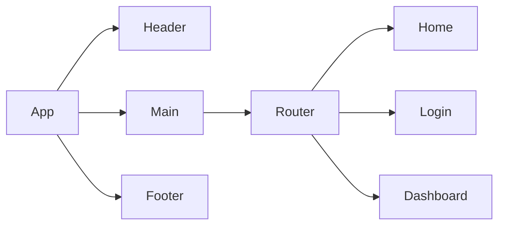

# Product Requirements Documentation

| Field | Detail |
| ----- | ------ |
| Project Name |  Content Management System |
| Description |  CMS to publish articles and read artiles and blogs  |
| Developer |   Izzy Zinxhirija   |
| Live Website | TBD  |
| Repo |  https://github.com/Izzy-2023/seir-seal-capstone-frontend |

## Problem being solved and Target Market

This CMS app is a modern content management system designed to address the common challenges faced by individual content creators and small businesses. This tool will provide users the ability to create and manage content using a user friendly interface. 

## User Stories

List of stories users should experience when using your application.

- Users should be able to view the site on desktop and mobile
- An administrator can add new users, so that I can grant access to new team members to manage content.
- A content editor can create, edit, and publish articles, so that I can manage the content efficiently.
- A content editor can insert images and videos into my articles, so that I can make the content more engaging.
- A content editor can tag and categorize articles, so that they are easy to organize and find by our readers.
- A content user can search for articles using keywords, so that I can quickly find specific content.
- As a user, I want the website to be accessible on mobile devices, so that I can view content on the go.
- As a user, I want to leave feedback on articles, so that I can interact with the content.

## Component Architecture

## User Interface Mockups

### Main Page

### Articles Page

### Login Page

